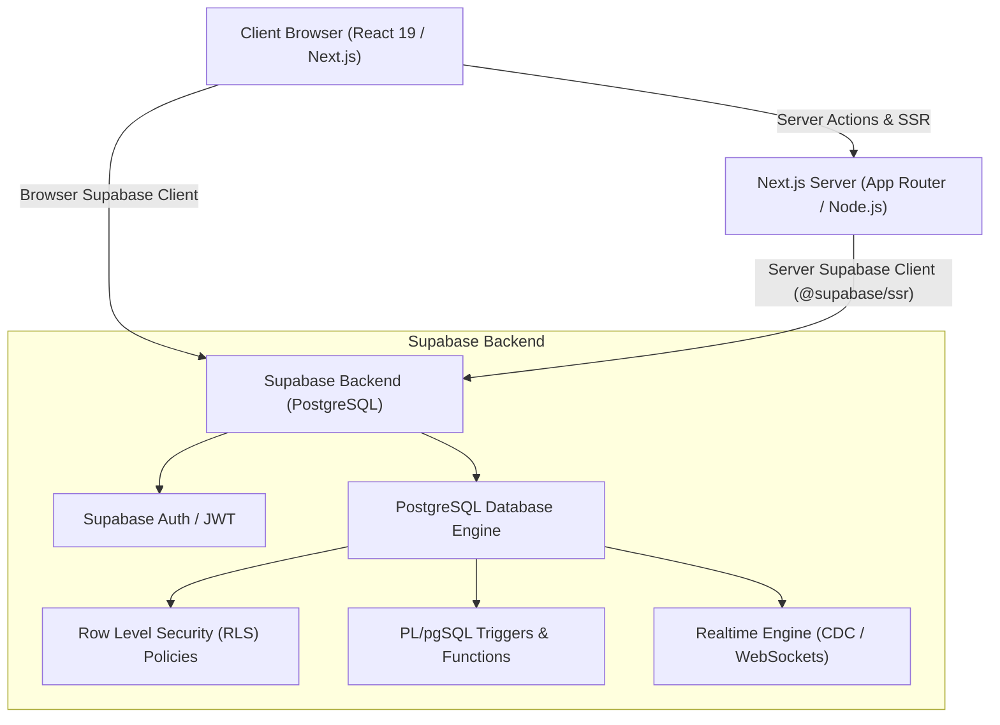
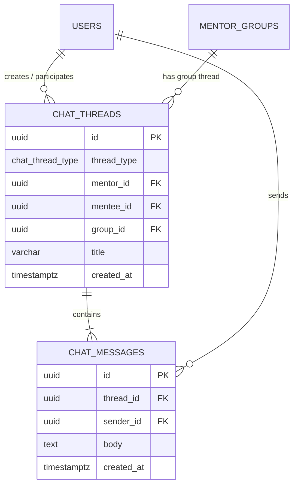
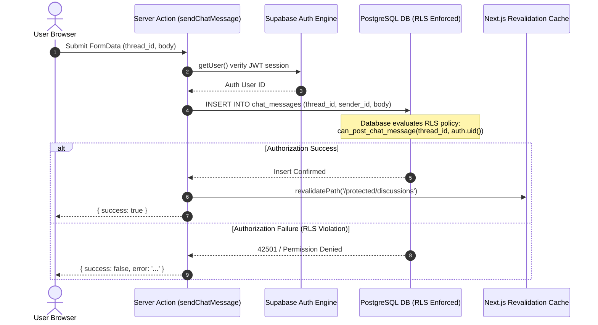

# MentorConnect (CounselConnect) — Technical Architecture & Backend Specification

This document provides a deep technical breakdown of the **CounselConnect / MentorConnect** backend implementation, database schema, matching algorithm, chat mechanics, and security model.

---

## 1. System Architecture Overview

CounselConnect is built as a modern, decoupled full-stack web application leveraging **Next.js 15 (App Router)** on the frontend/server layer and **Supabase (PostgreSQL 15+)** for data persistence, security, and realtime subscriptions.



### Key Components:
1. **Frontend & Server Components**: Next.js 15 App Router utilizing React Server Components (RSC) for SSR rendering and Server Actions for data mutations.
2. **Session Proxying**: `proxy.ts` / `@supabase/ssr` acts as middleware to handle cookie-based authentication sessions across server-side rendering and client navigation.
3. **Database Engine**: PostgreSQL with `uuid-ossp` and `pgcrypto` extensions. Business logic is partially enforced via database constraints, automated triggers, and `SECURITY DEFINER` functions.
4. **Security Model**: PostgreSQL Row Level Security (RLS) ensures that data authorization is enforced strictly at the database layer.

---

## 2. Database Architecture & Relational Schema

The relational model is organized into core domain modules: Identity & Auth, Profiles & Lookup, Mentor Allocations, Issues System, and Chat System.

### 2.1 Identity & Role-Based Access Control (RBAC)

The platform supports 7 distinct roles with explicit permission hierarchy levels (`permission_level` 1–6):

* **`roles` Table**: Stores system role metadata (`id`, `internal_name`, `display_title`, `permission_level`, `can_be_assigned_issues`, `requires_verification`).
  * `1`: Mentee (First Year Student)
  * `2`: Peer Mentor (2nd Year UG)
  * `3`: Senior Peer Mentor (3rd / 4th Year UG)
  * `4`: Postgraduate Mentor (M.Tech / PhD)
  * `5`: Counselling Committee Mentor
  * `6`: Professional Counsellor
  * `7`: Counselling Head
* **`users` Table**: Core entity extending Supabase auth user IDs with status tracking (`pending_verification`, `active`, `suspended`, `deactivated`) and onboarding state.
* **`user_roles` Table**: Junction table mapping `users` to `roles` (enables multi-role support e.g. a user acting both as a Mentee and a Mentor).

### 2.2 Profiles & Demographic Schema

* **`user_profiles` Table**: Holds academic details (`academic_background`: PCM, PCB, Commerce, Arts, Diploma; `department`), bio, preferred mentor criteria, and availability state (`max_mentees`, `current_mentees_count`, `is_accepting_mentees`).
* **`languages` & `user_languages` Tables**: Stores language capabilities (`code`, `name`) and maps users to their spoken languages along with proficiency levels (`native`, `fluent`, `intermediate`, `basic`).
* **`interest_tags` & `user_interests` Tables**: Stores taxonomy of technical/academic/personal interests mapped to users.

### 2.3 Mentor Allocation & Group Management

```sql
CREATE TABLE mentor_groups (
    id          UUID PRIMARY KEY DEFAULT uuid_generate_v4(),
    mentor_id   UUID NOT NULL REFERENCES users(id) ON DELETE CASCADE,
    group_name  VARCHAR(150) NOT NULL,
    academic_year VARCHAR(20),
    max_capacity INT NOT NULL DEFAULT 10,
    is_active   BOOLEAN NOT NULL DEFAULT TRUE,
    created_at  TIMESTAMPTZ NOT NULL DEFAULT NOW()
);

CREATE TABLE mentor_group_members (
    id          UUID PRIMARY KEY DEFAULT uuid_generate_v4(),
    group_id    UUID NOT NULL REFERENCES mentor_groups(id) ON DELETE CASCADE,
    mentee_id   UUID NOT NULL REFERENCES users(id) ON DELETE CASCADE,
    status      group_member_status NOT NULL DEFAULT 'active',
    joined_at   TIMESTAMPTZ NOT NULL DEFAULT NOW(),
    UNIQUE (group_id, mentee_id)
);
```

---

## 3. Smart Demographic Matching Engine

The matching system pairs Mentees with qualified Mentors using a **multi-factor weighted scoring algorithm**.

### 3.1 Scoring Formula

The match score $S \in [0, 1.0]$ between a mentee $M$ and mentor $P$ is computed as:

$$S = w_{bg} \cdot S_{bg} + w_{dom} \cdot S_{dom} + w_{lang} \cdot S_{lang} + w_{dept} \cdot S_{dept} + w_{int} \cdot S_{int}$$

Where the normalized weights ($w$) are configured as follows:

| Weight Factor | Field Name | Weight ($w$) | Logic / Description |
| :--- | :--- | :---: | :--- |
| **Background** | `background` | **0.30 (30%)** | `1.0` if exact preferred mentor background matches; `0.8` if backgrounds match without explicit preference; `0.4` otherwise. |
| **Domain** | `domain` | **0.25 (25%)** | Overlap between mentee's required domain and mentor's offered domains. |
| **Language** | `language` | **0.20 (20%)** | Overlap ratio of shared communication languages between mentee and mentor. |
| **Department** | `department` | **0.15 (15%)** | `1.0` if both mentee and mentor belong to the same college department/branch; `0.0` otherwise. |
| **Interests** | `interests` | **0.10 (10%)** | Overlap ratio of shared interest tags (`interest_tags`). |

### 3.2 Array Overlap Calculation (`arraySimilarity`)

Array similarities for domains, languages, and interest tags are calculated relative to the mentee's specified preferences using set intersection:

$$\text{Similarity}(A, B) = \frac{|A \cap B|}{|A|}$$

### 3.3 Hard Constraints & Capacity Filtering

Before scoring, mentors are filtered out if:
1. `is_accepting_mentees == false`
2. `current_mentees_count >= max_mentees`

Scores are calculated dynamically in Node.js/TypeScript (`lib/matchingEngine.ts`), sorted in descending order, and returned as a structured breakdown (`scoreBreakdown`).

---

## 4. Chat System & Messaging Architecture

The chat engine supports two thread modalities: **Direct Mentoring Threads (1-on-1)** and **Mentor Group Threads**.



### 4.1 Schema Constraints & Exclusivity

The database enforces data integrity for thread types via PostgreSQL `CHECK` and `UNIQUE` constraints:

```sql
CONSTRAINT chat_threads_direct_check CHECK (
    (thread_type = 'direct' AND mentee_id IS NOT NULL AND group_id IS NULL)
    OR
    (thread_type = 'group' AND mentee_id IS NULL AND group_id IS NOT NULL)
),
CONSTRAINT chat_threads_direct_unique UNIQUE (thread_type, mentor_id, mentee_id),
CONSTRAINT chat_threads_group_unique UNIQUE (thread_type, group_id)
```

### 4.2 Automated Thread Provisioning via PostgreSQL Triggers

To eliminate manual chat creation code, database triggers automatically instantiate chat threads when allocations occur:

1. **Group Chat Auto-Creation**: When a record is inserted into `mentor_groups`, `trg_create_group_chat_thread` fires a PL/pgSQL function (`create_group_chat_thread_for_mentor_group()`) creating a `group` thread.
2. **Direct Chat Auto-Creation**: When a mentee joins a group (`mentor_group_members`), `trg_create_direct_chat_thread` fires (`create_direct_chat_thread_for_membership()`), auto-creating a `direct` thread between the mentor and mentee.
3. **On-Demand Direct Provisioning**: A PL/pgSQL function `provision_direct_chat_thread(p_mentor_id, p_mentee_id)` with `SECURITY DEFINER` allows mentees to initiate a direct message thread with any active mentor on demand.

### 4.3 Chat Execution Flow (Next.js Server Actions)



---

## 5. Row Level Security (RLS) & Authorization Engine

All database tables have **Row Level Security (RLS)** enabled (`ALTER TABLE ... ENABLE ROW LEVEL SECURITY`). Authorization rules are defined directly inside PostgreSQL policies using custom `SQL` security functions.

### 5.1 Security Helper Functions

* `is_active_mentor(p_user_id)`: Checks if the user holds an active mentor role (`role_id > 1`).
* `is_active_mentee(p_user_id)`: Checks if the user holds an active mentee role (`role_id = 1`).
* `can_access_chat_thread(p_thread_id, p_user_id)`: Determines whether a user is either:
  * The assigned mentor or mentee in a direct chat.
  * The group mentor or an active member (`mentor_group_members.status = 'active'`) in a group chat.

### 5.2 Chat Message RLS Policies

```sql
-- Read Policy
CREATE POLICY "Allow participants to read chat messages"
ON chat_messages FOR SELECT
TO authenticated
USING (can_access_chat_thread(thread_id, auth.uid()));

-- Insert Policy
CREATE POLICY "Allow participants to send chat messages"
ON chat_messages FOR INSERT
TO authenticated
WITH CHECK (
    sender_id = auth.uid()
    AND can_post_chat_message(thread_id, auth.uid())
);
```

### 5.3 Integrated Issue Tracking & Ultra-Private Isolation

Issues raised by mentees support three visibility levels:
1. `public`: Visible to all authenticated users for community problem-solving.
2. `private`: Visible only to the mentee and their assigned mentor.
3. `ultra_private`: Automatically isolated to **Professional Counsellors** (`role_id = 6`) and **Counselling Head** (`role_id = 7`). Peer mentors cannot read or access ultra-private issues.

---

## 6. Content Moderation & Security Safeguards

* **Profanity Filtering**: Incoming chat messages and issue posts are filtered through `lib/content-filter.ts` using a standardized bad-words dictionary prior to persisting to DB.
* **Audit Trail Logging**: Sensitive state changes (such as role escalations, ultra-private issue views, and manual mentor re-allocations) write immutable records to the `audit_logs` table.

---

## 7. Backend Summary & Technology Stack Reference

| Layer | Technology | Key Responsibility |
| :--- | :--- | :--- |
| **Framework** | Next.js 15 (App Router) | SSR, React Server Components, Server Actions (`"use server"`) |
| **Database** | PostgreSQL 15+ (Supabase) | Relational storage, Triggers, Functions, Constraints |
| **Auth & Client** | `@supabase/ssr` & `@supabase/supabase-js` | Cookie-based session validation, Client & Server DB access |
| **Matching Algorithm** | TypeScript (`lib/matchingEngine.ts`) | Weighted scoring ($S_{bg}, S_{dom}, S_{lang}, S_{dept}, S_{int}$) |
| **Security Layer** | PostgreSQL RLS Policies | Data authorization, row isolation, Ultra-Private privacy |
| **Realtime Engine** | Supabase Realtime (WebSockets) | Live message dispatching and UI synchronization |
