# MentorConnect — Database Technical Documentation

**Engine**: PostgreSQL 15+ (hosted on Supabase)  
**Extensions**: `uuid-ossp`, `pgcrypto`  
**Total Tables**: 28  
**ENUMs**: 9  
**Indexes**: 25+  
**Triggers**: 10+  
**PL/pgSQL Functions**: 8  
**Migration Files**: 4 (`supabase_schema.sql`, `chat_migration.sql`, `issue_votes_migration.sql`, `issues_rls_migration.sql`, `provision_direct_thread.sql`)

---

## Table of Contents

1. [Database Design Philosophy](#1-database-design-philosophy)
2. [PostgreSQL Extensions](#2-postgresql-extensions)
3. [ENUM Type Definitions](#3-enum-type-definitions)
4. [Schema Sections & Tables](#4-schema-sections--tables)
   - [Section 1: Identity & RBAC](#section-1-identity--rbac)
   - [Section 2: Lookup Tables](#section-2-lookup-tables)
   - [Section 3: Issue Taxonomy](#section-3-issue-taxonomy)
   - [Section 4: User Profiles](#section-4-user-profiles)
   - [Section 5: ML Matching & Allocations](#section-5-ml-matching--allocations)
   - [Section 6: Issue Tracking System](#section-6-issue-tracking-system)
   - [Section 7: Ratings & Mentor Stats](#section-7-ratings--mentor-stats)
   - [Section 8: Audit Logs](#section-8-audit-logs)
   - [Section 9: Notifications](#section-9-notifications)
   - [Section 10: Chat System](#section-10-chat-system)
5. [Indexes & Query Optimization](#5-indexes--query-optimization)
6. [Triggers & Automation](#6-triggers--automation)
7. [PL/pgSQL Functions](#7-plpgsql-functions)
8. [Row Level Security (RLS)](#8-row-level-security-rls)
9. [Entity Relationship Diagram](#9-entity-relationship-diagram)
10. [Migration Execution Order](#10-migration-execution-order)

---

## 1. Database Design Philosophy

The MentorConnect database is designed around three core principles:

1. **Security-First**: All sensitive data access is governed at the database layer through PostgreSQL **Row Level Security (RLS)** policies, not just at the application layer. This means even if application code has a bug, the database refuses unauthorized reads/writes.

2. **Automation via Triggers**: Routine state management (updating timestamps, creating chat threads on allocation, recomputing vote scores) is handled by PL/pgSQL triggers to guarantee consistency regardless of which application pathway inserts data.

3. **Full Audit Traceability**: An append-only `audit_logs` table with `CREATE RULE` guards prevents any modification of historical records, creating an immutable trail for sensitive operations.

---

## 2. PostgreSQL Extensions

```sql
CREATE EXTENSION IF NOT EXISTS "uuid-ossp";   -- UUID generation (uuid_generate_v4())
CREATE EXTENSION IF NOT EXISTS "pgcrypto";    -- Cryptographic functions (gen_random_uuid, etc.)
```

All primary keys across every table use `UUID` type generated by `uuid_generate_v4()`. This prevents sequential ID enumeration attacks and decouples the database from insert ordering.

---

## 3. ENUM Type Definitions

ENUMs enforce data integrity at the type level — invalid values are rejected by PostgreSQL before any constraint or trigger fires.

| ENUM Name | Values | Used In |
|:---|:---|:---|
| `user_status` | `pending_verification`, `active`, `suspended`, `deactivated` | `users` |
| `onboarding_status` | `not_started`, `role_selected`, `profile_complete`, `verified`, `matched` | `users` |
| `academic_background` | `PCM`, `PCB`, `Commerce`, `Arts`, `Diploma`, `Other` | `mentee_profiles`, `mentor_ug_pg_profiles` |
| `comm_preference` | `chat`, `call`, `both` | `mentee_profiles` |
| `visibility_level` | `public`, `private`, `ultra_private` | `issues`, `issue_categories` |
| `issue_status` | `open`, `in_discussion`, `needs_escalation`, `resolved`, `closed` | `issues` |
| `approval_status` | `pending`, `approved`, `rejected`, `overridden` | `match_approvals` |
| `match_status` | `predicted`, `approved`, `rejected`, `assigned`, `removed` | `mentor_group_members` |
| `group_member_status` | `active`, `removed`, `transferred` | `mentor_group_members` |
| `language_proficiency` | `native`, `fluent`, `intermediate`, `basic` | `user_languages` |
| `escalation_status` | `open`, `acknowledged`, `resolved` | `issue_escalations` |
| `notification_type` | `match_proposed`, `match_approved`, `match_rejected`, `issue_assigned`, `issue_commented`, `issue_resolved`, `issue_escalated`, `group_added`, `rating_received`, `profile_verified`, `system` | `notifications` |
| `chat_thread_type` | `direct`, `group` | `chat_threads` |

---

## 4. Schema Sections & Tables

### Section 1: Identity & RBAC

#### `roles`
Seed table defining every user role in the hierarchy. Populated once during schema initialization; never modified at runtime.

| Column | Type | Description |
|:---|:---|:---|
| `id` | `SMALLINT PK` | Role ID (1–7). |
| `internal_name` | `VARCHAR(50) UNIQUE` | Machine-readable key (e.g. `mentor_ug_junior`). |
| `display_title` | `VARCHAR(100)` | Human-readable label for UI display. |
| `permission_level` | `SMALLINT` | Hierarchical level (1=lowest, 6=highest). Used for RLS comparisons (`role_id >= 5`). |
| `can_be_assigned_issues` | `BOOLEAN` | Whether this role can be assigned to issues. |
| `requires_verification` | `BOOLEAN` | Whether an admin must verify this role before it becomes active. |

**Seeded Roles:**

| ID | Internal Name | Display Title | Permission Level |
|:---:|:---|:---|:---:|
| 1 | `mentee` | Mentee – First Year Student | 1 |
| 2 | `mentor_ug_junior` | Peer Mentor – 2nd Year Undergraduate | 2 |
| 3 | `mentor_ug_senior` | Senior Peer Mentor – 3rd / 4th Year UG | 3 |
| 4 | `mentor_pg` | Postgraduate Mentor – M.Tech / PhD | 3 |
| 5 | `mentor_committee` | Counselling Committee Mentor | 4 |
| 6 | `mentor_professional` | Professional Counsellor | 5 |
| 7 | `mentor_head` | Counselling Head | 6 |

---

#### `users`
The core identity table. It mirrors Supabase Auth's `auth.users` table, synchronized automatically via the `on_auth_user_created` trigger.

| Column | Type | Description |
|:---|:---|:---|
| `id` | `UUID PK` | Matches `auth.users.id` exactly — the Supabase Auth UUID. |
| `email` | `VARCHAR(255) UNIQUE` | User's email, synced from auth. |
| `password_hash` | `TEXT` | Set to the literal string `'managed_by_supabase_auth'` — actual password is in Supabase Auth, not here. |
| `is_email_verified` | `BOOLEAN` | `true` if `email_confirmed_at` is set in auth. |
| `status` | `user_status` | Current lifecycle state. |
| `onboarding_status` | `onboarding_status` | Tracks which step of profile setup the user is on. |
| `last_login_at` | `TIMESTAMPTZ` | Updated on each sign-in. |

**Automatic Sync Trigger**: Every time a new user signs up through Supabase Auth, the `on_auth_user_created` trigger fires `handle_new_auth_user()` which upserts a corresponding row in this `users` table.

---

#### `user_roles`
Junction table linking users to roles. A single user can hold multiple roles simultaneously (e.g., a 2nd-year student can be both a Mentee and a Peer Mentor).

| Column | Type | Description |
|:---|:---|:---|
| `id` | `UUID PK` | — |
| `user_id` | `UUID FK → users` | The user. |
| `role_id` | `SMALLINT FK → roles` | The assigned role. |
| `assigned_by` | `UUID FK → users` | `NULL` = self-selected during onboarding; otherwise, an admin assigned it. |
| `is_active` | `BOOLEAN` | Only active roles are considered in RLS checks. |
| `verified_at` | `TIMESTAMPTZ` | When the role was verified by an admin (for roles requiring verification). |
| `UNIQUE (user_id, role_id)` | — | Prevents duplicate role assignments. |

---

### Section 2: Lookup Tables

#### `interest_tags`
Taxonomy of interests that users and mentors can tag themselves with. Used by the matching engine.

| Column | Type | Description |
|:---|:---|:---|
| `id` | `SERIAL PK` | Auto-incrementing integer ID. |
| `name` | `VARCHAR(100) UNIQUE` | e.g. `Machine Learning`, `Mental Health`, `DSA`. |
| `category` | `VARCHAR(50)` | Grouping: `academic`, `career`, `personal`. |
| `is_active` | `BOOLEAN` | Allows soft-disabling tags without deletion. |

#### `languages`
ISO 639-1 language registry. Used for mentor–mentee language compatibility matching.

| Column | Type | Description |
|:---|:---|:---|
| `id` | `SERIAL PK` | — |
| `code` | `VARCHAR(10) UNIQUE` | ISO code, e.g. `en`, `hi`, `mr`. |
| `name` | `VARCHAR(80) UNIQUE` | Full name, e.g. `English`, `Hindi`, `Marathi`. |

---

### Section 3: Issue Taxonomy

#### `issue_categories`
Defines categories of problems mentees can raise (Academic, Career, Mental Health, etc.).

| Column | Type | Description |
|:---|:---|:---|
| `id` | `SERIAL PK` | — |
| `name` | `VARCHAR(100) UNIQUE` | e.g. `Academic`, `Career`, `Mental Health`. |
| `default_visibility` | `visibility_level` | Default privacy when a mentee selects this category. |
| `requires_escalation` | `BOOLEAN` | If `true`, issues in this category auto-escalate to professional counsellors. |

#### `issue_labels`
Color-coded UI labels for tagging issues (e.g. `urgent`, `exam-stress`, `first-year`).

| Column | Type | Description |
|:---|:---|:---|
| `id` | `SERIAL PK` | — |
| `name` | `VARCHAR(80) UNIQUE` | Label text. |
| `color` | `CHAR(7)` | Hex color code for badge rendering (e.g. `#FF5733`). |

---

### Section 4: User Profiles

Profiles are split into **role-specific tables** — every user has a `user_profiles` row, then one additional table depending on their role.

#### `user_profiles` *(All Users)*

| Column | Type | Description |
|:---|:---|:---|
| `user_id` | `UUID PK FK → users` | 1-to-1 with users. |
| `full_name` | `VARCHAR(200)` | Display name. |
| `college_email` | `VARCHAR(255) UNIQUE` | Institutional email. |
| `department` | `VARCHAR(150)` | Academic department/branch. |
| `year_or_designation` | `VARCHAR(100)` | e.g. `1st Year B.Tech` or `Assistant Professor`. |
| `short_bio` | `TEXT` | Optional self-description. |
| `profile_photo_url` | `TEXT` | URL to avatar image (Supabase Storage). |
| `is_complete` | `BOOLEAN` | `true` when all mandatory profile fields are filled. |

---

#### `mentee_profiles` *(role_id = 1)*
Extends `user_profiles` with mentee-specific academic and preference data.

| Column | Type | Description |
|:---|:---|:---|
| `academic_background` | `academic_background` | PCM, PCB, Commerce, Arts, etc. |
| `current_challenges` | `TEXT[]` | Multi-select array of challenge tags (e.g. `{academics, homesickness}`). |
| `preferred_mentor_background` | `academic_background` | Optional preference for their mentor's background. |
| `preferred_mentor_domain` | `TEXT[]` | Domain preferences (e.g. `{academics, career}`). |
| `communication_preference` | `comm_preference` | Preferred mode: `chat`, `call`, or `both`. |

---

#### `mentor_ug_pg_profiles` *(role_id = 2, 3, 4, 5)*
Extends `user_profiles` with mentoring capacity and domain information.

| Column | Type | Description |
|:---|:---|:---|
| `academic_background` | `academic_background` | Mentor's own background. |
| `mentoring_domains` | `TEXT[]` | Domains they can mentor in (e.g. `{academics, mental_health}`). |
| `past_experience_desc` | `TEXT` | Free-form description of prior mentoring experience. |
| `max_mentees` | `SMALLINT` | Maximum mentees this mentor can handle. `CHECK (BETWEEN 1 AND 20)`. |
| `current_mentees_count` | `SMALLINT` | Active count. Used by the matching engine to filter full mentors. |
| `is_accepting_mentees` | `BOOLEAN` | Hard on/off switch for the matching engine. |

---

#### `professional_profiles` *(role_id = 6, 7)*
Extends `user_profiles` with professional counsellor credentials.

| Column | Type | Description |
|:---|:---|:---|
| `qualification` | `VARCHAR(255)` | e.g. `M.Phil Clinical Psychology`. |
| `years_of_experience` | `SMALLINT` | `CHECK (>= 0)`. |
| `specialization_areas` | `TEXT[]` | e.g. `{anxiety, career_crisis}`. |
| `is_emergency_available` | `BOOLEAN` | Can handle crisis escalations. |
| `can_escalate_to_external` | `BOOLEAN` | Can refer student to external services. |
| `license_number` | `VARCHAR(100)` | Professional certification number. |

---

#### `availability_slots`
Shared across all roles for scheduling sessions.

| Column | Type | Description |
|:---|:---|:---|
| `day_of_week` | `SMALLINT` | `0=Sunday` to `6=Saturday`. |
| `start_time` / `end_time` | `TIME` | `CHECK (end_time > start_time)`. |
| `is_recurring` | `BOOLEAN` | Weekly repeating vs. one-off slot. |
| `specific_date` | `DATE` | Non-null only for one-off slots. |
| `timezone` | `VARCHAR(50)` | Defaults to `Asia/Kolkata`. |

---

#### `user_interests` & `user_languages` *(Junction Tables)*

```
user_interests:  (user_id, tag_id)      → PRIMARY KEY
user_languages:  (user_id, language_id) → PRIMARY KEY + proficiency ENUM
```

These many-to-many junction tables connect users to the `interest_tags` and `languages` lookup tables. They drive the matching engine's interest and language overlap calculations.

---

### Section 5: ML Matching & Allocations

This is the core pipeline that connects mentees to mentors.

```
[ML Prediction] → [Admin Approval] → [Mentor Group] → [Group Member]
ml_match_predictions → match_approvals → mentor_groups → mentor_group_members
```

#### `ml_match_predictions`
Stores the raw output of the TypeScript matching engine.

| Column | Type | Description |
|:---|:---|:---|
| `mentee_id` | `UUID FK → users` | The mentee being matched. |
| `mentor_id` | `UUID FK → users` | The candidate mentor. |
| `match_score` | `NUMERIC(5,4)` | Score from `0.0000` to `1.0000`. `CHECK (BETWEEN 0 AND 1)`. |
| `score_breakdown` | `JSONB` | Detailed breakdown: `{"background": 0.24, "domain": 0.20, ...}`. |
| `model_version` | `VARCHAR(50)` | Version tag of the algorithm used (for reproducibility). |
| `expires_at` | `TIMESTAMPTZ` | Optional expiry for stale predictions. |
| `UNIQUE (mentee_id, mentor_id, model_version)` | — | One prediction per pair per model version. |

#### `match_approvals`
Human-in-the-loop review step where administrators approve or override ML predictions.

| Column | Type | Description |
|:---|:---|:---|
| `prediction_id` | `UUID FK → ml_match_predictions` | The prediction under review. |
| `reviewed_by` | `UUID FK → users` | Admin who reviewed. |
| `status` | `approval_status` | `pending`, `approved`, `rejected`, or `overridden`. |
| `override_mentor_id` | `UUID FK → users` | If the reviewer manually selects a different mentor. |
| `reviewer_notes` | `TEXT` | Optional justification. |

#### `mentor_groups`
The actual mentor–mentee group. Created after approval.

| Column | Type | Description |
|:---|:---|:---|
| `mentor_id` | `UUID FK → users` | The group's mentor. `ON DELETE RESTRICT` (prevents deleting a mentor with active groups). |
| `group_name` | `VARCHAR(200)` | Optional display name (e.g. `"CSE Batch A"`). |
| `max_capacity` | `SMALLINT` | Maximum mentees in this group. |
| `current_count` | `SMALLINT` | Live count (maintained by trigger). |
| `is_active` | `BOOLEAN` | Soft-delete flag. Inactive groups stop triggering new chat threads. |

#### `mentor_group_members`
Individual mentee membership records within a group.

| Column | Type | Description |
|:---|:---|:---|
| `group_id` | `UUID FK → mentor_groups` | The parent group. |
| `mentee_id` | `UUID FK → users` | The mentee being added. |
| `added_by` | `UUID FK → users` | Which committee member or system process added them. |
| `approval_ref_id` | `UUID FK → match_approvals` | Trace back to the approval that triggered this membership. |
| `status` | `group_member_status` | `active`, `removed`, or `transferred`. |
| `match_status` | `match_status` | `predicted`, `approved`, `rejected`, `assigned`, `removed`. |
| `left_at` | `TIMESTAMPTZ` | Populated when a mentee leaves or is transferred. |
| `UNIQUE (group_id, mentee_id)` | — | A mentee can only be in each group once. |

---

### Section 6: Issue Tracking System

A full issue lifecycle system with threaded comments, escalations, and resolution attribution.

#### `issues`

| Column | Type | Description |
|:---|:---|:---|
| `title` | `VARCHAR(300)` | Issue headline. |
| `description` | `TEXT` | Full problem description. |
| `creator_id` | `UUID FK → users` | `ON DELETE RESTRICT` — cannot delete a user with open issues. |
| `category_id` | `INTEGER FK → issue_categories` | Academic, Career, Mental Health, etc. |
| `visibility` | `visibility_level` | `public` / `private` / `ultra_private`. Controls RLS access. |
| `is_anonymous` | `BOOLEAN` | Hides `creator_id` from other users in the UI. |
| `status` | `issue_status` | Lifecycle state. |
| `is_locked` | `BOOLEAN` | Prevents new comments after closure. |
| `score` | `INTEGER` | Aggregated vote score. Automatically updated by `trg_issue_votes` trigger. |

#### `issue_votes`
Upvote/downvote system (like Stack Overflow). Each user can cast exactly one vote per issue.

| Column | Type | Description |
|:---|:---|:---|
| `issue_id` | `UUID FK → issues` | The voted-on issue. |
| `user_id` | `UUID FK → users` | The voter. |
| `vote_type` | `SMALLINT` | `+1` (upvote) or `-1` (downvote). `CHECK (vote_type IN (1, -1))`. |
| `PRIMARY KEY (issue_id, user_id)` | — | One vote per user per issue (enforced at DB level). |

The `trg_issue_votes` trigger fires on `INSERT / UPDATE / DELETE` and automatically adjusts `issues.score`:
```sql
-- On INSERT: score = score + NEW.vote_type
-- On UPDATE: score = score - OLD.vote_type + NEW.vote_type
-- On DELETE: score = score - OLD.vote_type
```

#### `issue_comments`
Supports **threaded/nested comments** via a self-referencing foreign key.

| Column | Type | Description |
|:---|:---|:---|
| `parent_comment_id` | `UUID FK → issue_comments` | `NULL` = top-level comment; non-null = reply. `ON DELETE SET NULL`. |
| `is_internal_note` | `BOOLEAN` | Visible only to mentors (`role_id >= 2`). Hidden from mentees. |
| `is_resolution_note` | `BOOLEAN` | Marks the comment as the formal resolution answer. |
| `is_edited` | `BOOLEAN` | Set to `true` if the comment body was ever modified. |

#### `issue_assignments`
Tracks which mentor is responsible for which issue.

| Column | Type | Description |
|:---|:---|:---|
| `issue_id` | `UUID FK → issues` | The issue. |
| `mentor_id` | `UUID FK → users` | The assigned mentor. |
| `is_primary` | `BOOLEAN` | `true` = primary mentor; `false` = supporting mentor. |
| `unassigned_at` | `TIMESTAMPTZ` | Populated when the mentor is removed from the issue. |

#### `issue_status_history`
Immutable lifecycle log for every status transition of an issue.

| Column | Type | Description |
|:---|:---|:---|
| `old_status` | `issue_status` | The previous state. |
| `new_status` | `issue_status` | The new state. |
| `changed_by` | `UUID FK → users` | Who made the change. |
| `note` | `TEXT` | Optional reason/comment for the transition. |

#### `issue_resolutions`
The formal closure record when an issue is resolved.

| Column | Type | Description |
|:---|:---|:---|
| `issue_id` | `UUID UNIQUE FK → issues` | One resolution per issue. |
| `resolved_by` | `UUID FK → users` | The mentor or admin who closed it. |
| `resolution_summary` | `TEXT` | Summary of how the issue was resolved. |
| `contributing_mentors` | `UUID[]` | Array of mentor UUIDs who contributed (GitHub-style attribution). |
| `can_reopen` | `BOOLEAN` | Whether the issue can be reopened if the solution doesn't work. |

#### `issue_escalations`
Formal escalation records when an issue needs higher-authority intervention.

| Column | Type | Description |
|:---|:---|:---|
| `escalated_to_role` | `SMALLINT FK → roles` | Escalate to a role category (e.g. all Counselling Heads). |
| `escalated_to_user` | `UUID FK → users` | Or escalate to a specific named person. |
| `reason` | `TEXT` | Mandatory justification for escalation. |
| `status` | `escalation_status` | `open`, `acknowledged`, `resolved`. |

---

### Section 7: Ratings & Mentor Stats

#### `mentor_ratings`
Individual rating events submitted by mentees after issue resolutions or group sessions.

| Column | Type | Description |
|:---|:---|:---|
| `mentor_id` | `UUID FK → users` | The rated mentor. |
| `rater_id` | `UUID FK → users` | `ON DELETE SET NULL` — rating survives if rater's account is deleted. |
| `group_id` | `UUID FK → mentor_groups` | If rating is related to a group experience. |
| `issue_id` | `UUID FK → issues` | If rating is tied to a specific issue resolution. |
| `score` | `SMALLINT` | `CHECK (BETWEEN 1 AND 5)`. |
| `is_anonymous` | `BOOLEAN` | Hides rater identity from mentor. |
| `UNIQUE (rater_id, mentor_id, issue_id)` | — | One rating per mentee per resolved issue. |

#### `mentor_stats`
Aggregated performance dashboard for each mentor. Computed by the `refresh_mentor_stats(UUID)` function.

| Column | Type | Description |
|:---|:---|:---|
| `mentor_id` | `UUID PK FK → users` | 1-to-1 with a mentor user. |
| `total_mentees_served` | `INTEGER` | Lifetime count of all mentees ever in their groups. |
| `active_mentees` | `SMALLINT` | Current live count. |
| `avg_rating` | `NUMERIC(3,2)` | Average star rating (e.g. `4.72`). |
| `resolution_rate` | `NUMERIC(5,4)` | `issues_resolved / issues_assigned` (e.g. `0.8750`). |
| `total_comments_made` | `INTEGER` | Engagement metric. |
| `last_active_at` | `TIMESTAMPTZ` | Date of their most recent comment. |

---

### Section 8: Audit Logs

#### `audit_logs`
An **append-only** immutable audit trail for sensitive operations.

| Column | Type | Description |
|:---|:---|:---|
| `id` | `BIGSERIAL PK` | Integer sequence — faster than UUID for append-only logs. |
| `actor_id` | `UUID FK → users` | `ON DELETE SET NULL` — log is preserved even if user is deleted. |
| `action_type` | `VARCHAR(80)` | e.g. `issue.viewed`, `issue.assigned`, `comment.deleted`. |
| `target_table` | `VARCHAR(80)` | Which table was affected. |
| `target_id` | `TEXT` | The PK of the affected row (stored as text to support any type). |
| `old_value` | `JSONB` | Previous state (for UPDATE operations). |
| `new_value` | `JSONB` | New state (for INSERT/UPDATE operations). |
| `ip_address` | `INET` | Requesting IP address. |
| `user_agent` | `TEXT` | Browser/client identifier. |

**Immutability Protection**: Two `CREATE RULE` directives completely prevent modification or deletion of audit records at the database engine level:
```sql
CREATE RULE no_update_audit AS ON UPDATE TO audit_logs DO INSTEAD NOTHING;
CREATE RULE no_delete_audit AS ON DELETE TO audit_logs DO INSTEAD NOTHING;
```

---

### Section 9: Notifications

#### `notifications`
In-app notification system for all system events.

| Column | Type | Description |
|:---|:---|:---|
| `recipient_id` | `UUID FK → users` | The user who receives this notification. |
| `type` | `notification_type` | Typed category for frontend rendering logic. |
| `title` | `VARCHAR(200)` | Short notification headline. |
| `related_entity_type` | `VARCHAR(80)` | e.g. `issue`, `mentor_group`, `chat_thread`. |
| `related_entity_id` | `UUID` | FK to whatever entity is referenced (polymorphic pattern). |
| `action_url` | `TEXT` | Deep link URL for the notification click. |
| `is_read` | `BOOLEAN` | Unread badge logic. |

---

### Section 10: Chat System

#### `chat_threads`
Parent thread record. Has strict `CHECK` constraints enforcing valid combinations.

| Column | Type | Description |
|:---|:---|:---|
| `thread_type` | `chat_thread_type` | `direct` or `group`. |
| `mentor_id` | `UUID FK → users` | Always required — direct or group, a mentor anchors the thread. |
| `mentee_id` | `UUID FK → users` | Required if `thread_type = 'direct'`; must be `NULL` if `group`. |
| `group_id` | `UUID FK → mentor_groups` | Required if `thread_type = 'group'`; must be `NULL` if `direct`. |

**DB Constraints:**
```sql
-- Exclusivity: direct threads have a mentee, group threads have a group
CONSTRAINT chat_threads_direct_check CHECK (
    (thread_type = 'direct' AND mentee_id IS NOT NULL AND group_id IS NULL)
    OR
    (thread_type = 'group'  AND mentee_id IS NULL     AND group_id IS NOT NULL)
),
-- Uniqueness: one direct thread per mentor-mentee pair
CONSTRAINT chat_threads_direct_unique UNIQUE (thread_type, mentor_id, mentee_id),
-- Uniqueness: one group thread per group
CONSTRAINT chat_threads_group_unique  UNIQUE (thread_type, group_id)
```

#### `chat_messages`

| Column | Type | Description |
|:---|:---|:---|
| `thread_id` | `UUID FK → chat_threads` | `ON DELETE CASCADE` — messages deleted with thread. |
| `sender_id` | `UUID FK → users` | `ON DELETE CASCADE`. |
| `body` | `TEXT` | Message content (content-filtered before insert at app layer). |
| `created_at` | `TIMESTAMPTZ` | Indexed as `(thread_id, created_at DESC)` for fast conversation fetching. |

---

## 5. Indexes & Query Optimization

All indexes are defined to optimize the application's most frequent query patterns.

| Index Name | Table | Column(s) | Purpose |
|:---|:---|:---|:---|
| `idx_users_email` | `users` | `email` | Login lookup. |
| `idx_users_status` | `users` | `status` | Filter active users. |
| `idx_user_roles_user` | `user_roles` | `user_id` | Get all roles of a user. |
| `idx_user_roles_role` | `user_roles` | `role_id` | Get all users with a role. |
| `idx_user_profiles_dept` | `user_profiles` | `department` | Department-based filtering. |
| `idx_ml_mentee` | `ml_match_predictions` | `mentee_id` | Fetch predictions for a mentee. |
| `idx_ml_mentor` | `ml_match_predictions` | `mentor_id` | Fetch predictions for a mentor. |
| `idx_ml_score` | `ml_match_predictions` | `match_score DESC` | Top-N match queries. |
| `idx_group_mentor` | `mentor_groups` | `mentor_id` | Get groups of a mentor. |
| `idx_group_members_mentee` | `mentor_group_members` | `mentee_id` | Find a mentee's group. |
| `idx_issues_status` | `issues` | `status` | Filter open/resolved issues. |
| `idx_issues_visibility` | `issues` | `visibility` | RLS-aware visibility queries. |
| `idx_issues_created` | `issues` | `created_at DESC` | Chronological issue feed. |
| `idx_issues_score` | `issues` | `score DESC` | Sort issues by upvotes. |
| `idx_chat_messages_thread` | `chat_messages` | `(thread_id, created_at DESC)` | Paginated conversation loading. |
| `idx_audit_created` | `audit_logs` | `created_at DESC` | Chronological audit queries. |
| `idx_notif_recipient` | `notifications` | `(recipient_id, is_read)` | Unread notification badge. |

---

## 6. Triggers & Automation

| Trigger Name | Table | Event | Function Called | Purpose |
|:---|:---|:---|:---|:---|
| `on_auth_user_created` | `auth.users` | `AFTER INSERT` | `handle_new_auth_user()` | Syncs new Supabase Auth user into `public.users`. |
| `trg_users_updated` | `users` | `BEFORE UPDATE` | `set_updated_at()` | Auto-stamps `updated_at`. |
| `trg_user_profiles_updated` | `user_profiles` | `BEFORE UPDATE` | `set_updated_at()` | Auto-stamps `updated_at`. |
| `trg_mentee_profiles_updated` | `mentee_profiles` | `BEFORE UPDATE` | `set_updated_at()` | Auto-stamps `updated_at`. |
| `trg_mentor_ug_updated` | `mentor_ug_pg_profiles` | `BEFORE UPDATE` | `set_updated_at()` | Auto-stamps `updated_at`. |
| `trg_issues_updated` | `issues` | `BEFORE UPDATE` | `set_updated_at()` | Auto-stamps `updated_at`. |
| `trg_comments_updated` | `issue_comments` | `BEFORE UPDATE` | `set_updated_at()` | Auto-stamps `updated_at`. |
| `trg_mentor_groups_updated` | `mentor_groups` | `BEFORE UPDATE` | `set_updated_at()` | Auto-stamps `updated_at`. |
| `trg_issue_votes` | `issue_votes` | `AFTER INSERT / UPDATE / DELETE` | `update_issue_score()` | Recomputes `issues.score` on every vote change. |
| `trg_create_group_chat_thread` | `mentor_groups` | `AFTER INSERT` | `create_group_chat_thread_for_mentor_group()` | Auto-creates group chat thread when a mentor group is formed. |
| `trg_create_direct_chat_thread` | `mentor_group_members` | `AFTER INSERT / UPDATE OF status` | `create_direct_chat_thread_for_membership()` | Auto-creates 1-on-1 chat thread when a mentee joins a group. |
| `trg_chat_threads_updated` | `chat_threads` | `BEFORE UPDATE` | `set_updated_at()` | Auto-stamps `updated_at`. |

---

## 7. PL/pgSQL Functions

#### `set_updated_at()` — Timestamp Automation
```sql
-- Called by all BEFORE UPDATE triggers.
-- Sets NEW.updated_at = NOW() before writing the row.
```

#### `handle_new_auth_user()` — Auth Sync *(SECURITY DEFINER)*
```sql
-- Fires on AFTER INSERT on auth.users.
-- Upserts a corresponding row into public.users.
-- Sets status based on whether email_confirmed_at is set.
```

#### `update_issue_score()` — Vote Aggregation
```sql
-- Fires after any INSERT, UPDATE, or DELETE on issue_votes.
-- Atomically increments or decrements issues.score:
--   INSERT → score + NEW.vote_type
--   UPDATE → score - OLD.vote_type + NEW.vote_type
--   DELETE → score - OLD.vote_type
```

#### `is_active_mentor(UUID)` — Security Helper
```sql
-- Returns TRUE if the given user has role_id > 1 with is_active = TRUE.
-- Used inside RLS policies for fast inline checks.
```

#### `is_active_mentee(UUID)` — Security Helper
```sql
-- Returns TRUE if the given user has role_id = 1 with is_active = TRUE.
```

#### `can_access_chat_thread(UUID, UUID)` — Chat Authorization *(SECURITY DEFINER)*
```sql
-- Returns TRUE if p_user_id is a valid participant of p_thread_id:
--   direct thread → user must be the mentor OR the mentee
--   group thread  → user must be the mentor OR an active group member
```

#### `provision_direct_chat_thread(UUID, UUID)` — On-Demand Thread Creation *(SECURITY DEFINER)*
```sql
-- Creates a direct chat thread between any mentor and mentee if one
-- doesn't exist. Uses SECURITY DEFINER to bypass RLS, enabling
-- the "message any mentor" feature from the mentor discovery page.
-- Returns the UUID of the thread (existing or newly created).
```

#### `refresh_mentor_stats(UUID)` — Stats Aggregation
```sql
-- Computes and upserts a full stats row for a given mentor by
-- running several aggregate sub-queries across:
--   mentor_group_members, mentor_ratings, issue_assignments,
--   issue_resolutions, issue_comments
-- Should be called after rating events or issue closures.
```

---

## 8. Row Level Security (RLS)

Every data table in the schema has RLS enabled. Access is determined **entirely inside PostgreSQL** — the application cannot bypass these rules.

### Issues & Visibility

| Policy | Operation | Who Can Access |
|:---|:---|:---|
| Public issues | SELECT | Any authenticated user |
| Private issues | SELECT | Creator + any user with `role_id >= 2` |
| Ultra-private issues | SELECT | Creator + users with `role_id >= 5` (Counsellors & Heads only) |
| Create issue | INSERT | Any authenticated user (`creator_id = auth.uid()`) |
| Update issue | UPDATE | Creator or any mentor (`role_id >= 2`) |

### Issue Comments

| Policy | Operation | Who Can Access |
|:---|:---|:---|
| Read comments | SELECT | Users who can see the parent issue; internal notes require `role_id >= 2` |
| Post comment | INSERT | Author must match `auth.uid()`; parent issue must be visible |

### Issue Votes

| Policy | Operation | Rule |
|:---|:---|:---|
| Read votes | SELECT | Public (no restriction) |
| Insert vote | INSERT | `user_id = auth.uid()` |
| Update vote | UPDATE | `user_id = auth.uid()` |
| Delete vote | DELETE | `user_id = auth.uid()` |

### Chat Threads & Messages

| Policy | Operation | Rule |
|:---|:---|:---|
| Read thread | SELECT | `can_access_chat_thread(id, auth.uid())` |
| Create thread | INSERT | `created_by = auth.uid()` + valid mentor/mentee roles + valid group ownership |
| Read message | SELECT | `can_access_chat_thread(thread_id, auth.uid())` |
| Send message | INSERT | `sender_id = auth.uid()` + `can_post_chat_message(thread_id, auth.uid())` |

---

## 9. Entity Relationship Diagram

```mermaid
erDiagram
    users ||--o{ user_roles : "assigned"
    roles ||--o{ user_roles : "defines"
    users ||--|| user_profiles : "has"
    users ||--o| mentee_profiles : "has (mentees)"
    users ||--o| mentor_ug_pg_profiles : "has (UG/PG mentors)"
    users ||--o| professional_profiles : "has (professionals)"
    users ||--o{ user_interests : "tagged with"
    users ||--o{ user_languages : "speaks"
    interest_tags ||--o{ user_interests : "categorizes"
    languages ||--o{ user_languages : "defines"

    users ||--o{ ml_match_predictions : "mentee/mentor"
    ml_match_predictions ||--o{ match_approvals : "reviewed via"
    match_approvals ||--o{ mentor_group_members : "triggers"
    mentor_groups ||--|{ mentor_group_members : "contains"
    users ||--o{ mentor_groups : "mentors"

    users ||--o{ issues : "creates"
    issue_categories ||--o{ issues : "categorizes"
    issues ||--o{ issue_comments : "has"
    issues ||--o{ issue_votes : "receives"
    issues ||--o{ issue_assignments : "assigned via"
    issues ||--o| issue_resolutions : "closed by"
    issues ||--o{ issue_escalations : "escalated via"
    issues ||--o{ issue_status_history : "logged in"

    users ||--o{ mentor_ratings : "rated"
    users ||--|| mentor_stats : "aggregated in"

    mentor_groups ||--o{ chat_threads : "has group thread"
    users ||--o{ chat_threads : "participates"
    chat_threads ||--|{ chat_messages : "contains"

    users ||--o{ notifications : "receives"
    users ||--o{ audit_logs : "tracked in"
```



---

## 10. Migration Execution Order

Run the SQL files in **this exact order** in the Supabase SQL Editor to set up the full database:

| Step | File | What It Creates |
|:---:|:---|:---|
| 1 | `supabase_schema.sql` | All core tables, ENUMs, indexes, triggers, auth sync trigger, `refresh_mentor_stats()` |
| 2 | `chat_migration.sql` | `chat_threads`, `chat_messages`, RLS policies, auto-provisioning triggers |
| 3 | `issue_votes_migration.sql` | `issue_votes` table, `update_issue_score()` trigger, vote RLS policies |
| 4 | `issues_rls_migration.sql` | RLS policies for `issues`, `issue_comments`, `issue_resolutions` |
| 5 | `provision_direct_thread.sql` | `provision_direct_chat_thread()` SECURITY DEFINER function |
| 6 | `seed_data.sql` | Sample mentor/mentee users, groups, issues, and ratings for development |

> [!CAUTION]
> Do NOT run `seed_data.sql` in a production environment. It contains test users and dummy data intended only for local development.

> [!IMPORTANT]
> Steps 3 and 4 assume `supabase_schema.sql` (Step 1) has already executed successfully, as they reference tables (`issues`, `users`) and functions (`set_updated_at`) defined there.
