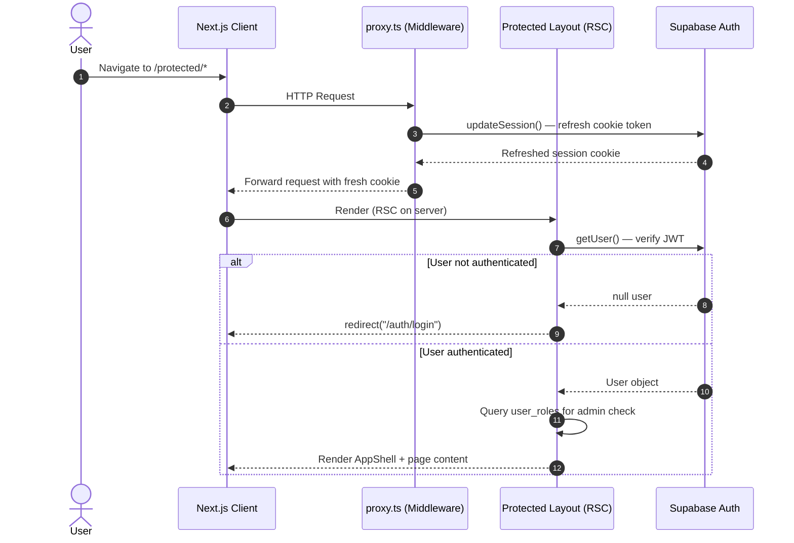

# MentorConnect — Frontend Technical Documentation

**Framework**: Next.js 15 (App Router)  
**Language**: TypeScript 5  
**UI Library**: Shadcn/UI + Radix UI Primitives  
**Styling**: Tailwind CSS v3 + CSS Custom Properties  
**Animation**: Framer Motion  
**Font**: Geist Sans (Google Fonts via `next/font`)  
**Icons**: Lucide React  
**Theme**: `next-themes` (Light / Dark / System)  

---

## Table of Contents

1. [Technology Stack Overview](#1-technology-stack-overview)
2. [Project Structure](#2-project-structure)
3. [Routing Architecture (Next.js App Router)](#3-routing-architecture-nextjs-app-router)
4. [Rendering Strategy — RSC vs Client Components](#4-rendering-strategy--rsc-vs-client-components)
5. [Design System & Styling](#5-design-system--styling)
6. [Component Architecture](#6-component-architecture)
7. [Authentication Flow](#7-authentication-flow)
8. [Data Fetching Patterns](#8-data-fetching-patterns)
9. [Server Actions](#9-server-actions)
10. [AI Assistant Integration](#10-ai-assistant-integration)
11. [TypeScript Configuration](#11-typescript-configuration)
12. [Deployment & Environment](#12-deployment--environment)

---

## 1. Technology Stack Overview

| Category | Technology | Version | Role |
|:---|:---|:---:|:---|
| **Meta-framework** | Next.js | 15 (latest) | Routing, SSR, Server Actions, API Routes |
| **UI Framework** | React | 19 | Component model, hooks, client interactivity |
| **Language** | TypeScript | ^5 | Type safety across all components and utilities |
| **Styling** | Tailwind CSS | ^3.4 | Utility-first CSS with custom design tokens |
| **UI Primitives** | Radix UI | Various | Accessible headless components (Dialog, Dropdown, Checkbox) |
| **Component Library** | Shadcn/UI | (via components.json) | Pre-built, customizable components on top of Radix |
| **Animation** | Framer Motion | ^12.38 | Physics-based animations for AI assistant, transitions |
| **Icons** | Lucide React | ^0.511 | SVG icon set used throughout the UI |
| **Theme** | next-themes | ^0.4.6 | System-aware dark/light mode switching |
| **Database Client** | @supabase/supabase-js | latest | Browser-side Supabase queries |
| **SSR Auth Client** | @supabase/ssr | latest | Cookie-based server-side Supabase sessions |
| **Content Filter** | bad-words | ^4.1.5 | Client-side profanity filtering before submissions |
| **Build Linting** | ESLint + eslint-config-next | 15.3.1 | Code quality enforcement |
| **CSS Processing** | PostCSS + Autoprefixer | ^8 | Tailwind build pipeline |

---

## 2. Project Structure

```
MentorConnect/
├── app/                          # Next.js App Router root
│   ├── layout.tsx                # Root layout (font, theme provider, metadata)
│   ├── page.tsx                  # Public landing page (/)
│   ├── globals.css               # Global CSS + Tailwind directives + custom classes
│   ├── favicon.ico / OG images   # SEO assets
│   ├── auth/                     # Public authentication routes
│   │   ├── login/
│   │   ├── sign-up/
│   │   ├── sign-up-success/
│   │   ├── forgot-password/
│   │   ├── update-password/
│   │   ├── confirm/              # Email confirmation callback
│   │   └── error/
│   ├── issues/                   # Public issue board (/issues)
│   ├── profile/                  # Profile setup page (/profile)
│   ├── protected/                # Authenticated area (auth-gated layout)
│   │   ├── layout.tsx            # Auth guard + AppShell + AiAssistant
│   │   ├── page.tsx              # Dashboard (/protected)
│   │   ├── discussions/          # Direct chat threads
│   │   ├── mentor-rooms/         # Group chat threads
│   │   ├── mentors/              # Mentor discovery & cards
│   │   ├── tasks/                # Task management
│   │   ├── feedback/             # Feedback submission
│   │   ├── reports/              # Analytics & reports
│   │   └── admin/                # Admin allocation panel
│   └── api/
│       └── chat/                 # AI chat API route (Edge runtime)
│
├── components/                   # Shared component library
│   ├── ui/                       # Shadcn/UI base components
│   │   ├── button.tsx
│   │   ├── card.tsx
│   │   ├── input.tsx
│   │   ├── label.tsx
│   │   ├── badge.tsx
│   │   ├── checkbox.tsx
│   │   ├── dialog.tsx
│   │   ├── dropdown-menu.tsx
│   │   ├── select.tsx
│   │   └── textarea.tsx
│   ├── workspace/
│   │   ├── app-shell.tsx         # 3-column authenticated layout shell
│   │   └── insights-components.tsx
│   ├── chat/
│   │   ├── AiAssistant.tsx       # Floating AI chatbot (Framer Motion + @ai-sdk/react)
│   │   └── chat-thread-view.tsx  # Message thread renderer
│   ├── profile/                  # Profile-specific components
│   ├── auth-button.tsx           # Session-aware sign-in/out button
│   ├── profile-form.tsx          # Multi-step profile setup form
│   ├── login-form.tsx
│   ├── sign-up-form.tsx
│   ├── sign-up-onboarding.tsx    # Role selection step
│   ├── admin-allocation-panel.tsx
│   ├── trigger-matching-button.tsx
│   ├── interest-selector.tsx     # Chip-style multi-select
│   ├── theme-switcher.tsx        # Light/Dark/System toggle
│   ├── user-nav.tsx
│   └── hero.tsx
│
├── lib/                          # Shared utilities and backend logic
│   ├── supabase/
│   │   ├── client.ts             # Browser Supabase client
│   │   ├── server.ts             # Server Supabase client (SSR cookies)
│   │   └── proxy.ts              # Middleware session refresh logic
│   ├── matchingEngine.ts         # Weighted scoring algorithm
│   ├── chat.ts                   # Chat data-fetching helpers
│   ├── content-filter.ts         # bad-words profanity filter
│   └── utils.ts                  # cn() class merging utility
│
├── proxy.ts                      # Next.js middleware (session proxy)
├── next.config.ts
├── tailwind.config.ts
├── tsconfig.json
├── components.json               # Shadcn/UI configuration
└── docs/                         # Technical documentation
```

---

## 3. Routing Architecture (Next.js App Router)

The application uses the **Next.js 15 App Router** with file-system based routing. Every `page.tsx` inside the `app/` directory automatically becomes a route.

### Route Map

```mermaid
graph TD
    Root["/"] --> Landing["Landing Page (page.tsx)"]
    Root --> Auth["/auth/*"]
    Root --> Issues["/issues — Public Issue Board"]
    Root --> Profile["/profile — Profile Setup"]
    Root --> Protected["/protected/* — Auth-Gated"]

    Auth --> Login["/auth/login"]
    Auth --> SignUp["/auth/sign-up"]
    Auth --> ForgotPwd["/auth/forgot-password"]
    Auth --> UpdatePwd["/auth/update-password"]
    Auth --> Confirm["/auth/confirm — Email Callback"]

    Protected --> Dashboard["/protected — Dashboard"]
    Protected --> Groups["/protected/mentor-rooms — Group Chats"]
    Protected --> GroupChat["/protected/mentor-rooms/group/[groupId]"]
    Protected --> Discussions["/protected/discussions — Direct Chats"]
    Protected --> DirectChat["/protected/discussions/direct/[mentorId]/[menteeId]"]
    Protected --> Mentors["/protected/mentors — Mentor Discovery"]
    Protected --> Tasks["/protected/tasks"]
    Protected --> Feedback["/protected/feedback"]
    Protected --> Reports["/protected/reports"]
    Protected --> Admin["/protected/admin — Admin Panel"]
```



### Dynamic Segments

| Route Pattern | Segment | Description |
|:---|:---|:---|
| `/protected/discussions/[...chatPath]` | Catch-all | Handles both `/direct/[mentorId]/[menteeId]` and `/group/[groupId]` paths |
| `/protected/mentor-rooms/group/[groupId]` | `groupId` | Loads a specific group chat thread |

---

## 4. Rendering Strategy — RSC vs Client Components

The application uses a deliberate **hybrid rendering model** combining React Server Components (RSC) with Client Components, following Next.js 15 best practices.

### Decision Rules

| Component Type | Directive | Used When |
|:---|:---|:---|
| **React Server Component (RSC)** | *(none — default)* | Data fetching, layout, read-only content, server-only secrets |
| **Client Component** | `"use client"` | Browser interactivity, `useState`, `useEffect`, event handlers, browser APIs |

### Component Classification

```
SERVER COMPONENTS (RSC)              CLIENT COMPONENTS ("use client")
─────────────────────────────────    ─────────────────────────────────
app/layout.tsx                       components/workspace/app-shell.tsx
app/protected/layout.tsx             components/chat/AiAssistant.tsx
app/protected/page.tsx               components/theme-switcher.tsx
app/protected/mentors/page.tsx       components/trigger-matching-button.tsx
app/protected/discussions/page.tsx   components/user-nav.tsx
lib/chat.ts (data layer)             components/profile-form.tsx
lib/supabase/server.ts               components/login-form.tsx
                                     components/sign-up-form.tsx
```

### Protected Layout Auth Guard

The `app/protected/layout.tsx` is the auth boundary — a **server component** that:

1. Creates a server-side Supabase client (using cookies).
2. Calls `supabase.auth.getUser()` to verify the JWT session.
3. If no user is found, calls `redirect("/auth/login")` from `next/navigation` — a server-side redirect.
4. Queries `user_roles` to check if the user has `role_id = 7` (Counselling Head) to conditionally show the Admin panel link.
5. Passes `userEmail` and `showAdmin` props into `<AppShell>` and renders `<AiAssistant />`.

```typescript
// app/protected/layout.tsx (simplified)
export default async function ProtectedLayout({ children }) {
  const supabase = await createClient();          // Server-only client
  const { data: { user } } = await supabase.auth.getUser();
  if (!user) redirect("/auth/login");             // Server redirect
  
  const { data: highestRole } = await supabase
    .from("user_roles")
    .select("role_id")
    .eq("user_id", user.id)
    .eq("role_id", 7)               // Counselling Head check
    .eq("is_active", true)
    .maybeSingle();

  return (
    <AppShell userEmail={user.email} showAdmin={Boolean(highestRole)}>
      {children}
      <AiAssistant />
    </AppShell>
  );
}
```

---

## 5. Design System & Styling

### 5.1 Tailwind CSS + CSS Custom Properties

The design system is built on **CSS Custom Properties (HSL color tokens)** defined in `app/globals.css`, consumed by Tailwind via `tailwind.config.ts`. This is the standard Shadcn/UI pattern.

Every color in the UI references a semantic token, not a raw hex value. This enables instant dark mode switching by simply swapping the values of CSS variables in the `.dark` class.

**Light Mode Tokens:**
```css
:root {
  --background:   210 17% 98%;    /* Near-white page background */
  --foreground:   210 12% 16%;    /* Dark text */
  --card:         0 0% 100%;      /* White cards */
  --primary:      212 92% 45%;    /* CounselConnect blue */
  --muted:        210 14% 96%;    /* Subtle fills */
  --border:       214 13% 84%;    /* Input/card borders */
  --ring:         212 92% 45%;    /* Focus ring (same as primary) */
  --radius:       0.5rem;         /* Border radius base */
}
```

**Dark Mode Tokens (`.dark` class override):**
```css
.dark {
  --background:   220 14% 10%;    /* Near-black */
  --foreground:   210 17% 92%;    /* Off-white text */
  --card:         220 14% 12%;    /* Slightly lighter than bg */
  --primary:      212 92% 60%;    /* Lighter blue for contrast */
  --border:       220 10% 28%;    /* Subtle dark borders */
}
```

### 5.2 Tailwind Configuration

`tailwind.config.ts` extends the default theme so every Tailwind utility class (`bg-primary`, `text-foreground`, `border-border`) maps to the CSS custom properties:

```typescript
// tailwind.config.ts
theme: {
  extend: {
    colors: {
      background: "hsl(var(--background))",
      foreground: "hsl(var(--foreground))",
      primary: { DEFAULT: "hsl(var(--primary))", foreground: "..." },
      card: { DEFAULT: "hsl(var(--card))", ... },
      // ... all tokens mapped
    },
    borderRadius: {
      lg: "var(--radius)",          // 0.5rem
      md: "calc(var(--radius) - 2px)",
      sm: "calc(var(--radius) - 4px)",
    },
  },
},
plugins: [require("tailwindcss-animate")],   // Tailwind Animate plugin
```

The `tailwindcss-animate` plugin provides CSS animation utilities (`animate-bounce`, `animate-spin`, fade/zoom keyframes) used throughout the app.

### 5.3 Custom CSS Classes (globals.css)

Beyond Tailwind utilities, `globals.css` defines named semantic classes for complex, reusable patterns:

| Class | Purpose | Used In |
|:---|:---|:---|
| `.form` | Glassmorphism auth card container | Login, Sign-up pages |
| `.form-title` / `.form-subtitle` | Consistent auth typography | All auth pages |
| `.button` / `.submit-btn` | Primary action buttons | Auth & profile forms |
| `.roles-grid` / `.role-tile` | 2-column role selection grid | Onboarding step |
| `.profile-form` / `.form-row` / `.form-group` | Responsive profile layout | Profile setup |
| `.chip` / `.chip.selected` | Interest selector chips | Interest selection |
| `.form-control` | Styled form input override | Profile form inputs |
| `.interest-container` | Chip group wrapper | Interest selector |

### 5.4 Typography

The root font is **Geist Sans** (from Vercel, loaded via `next/font/google`):

```typescript
// app/layout.tsx
const geistSans = Geist({
  variable: "--font-geist-sans",
  display: "swap",       // Show fallback font immediately
  subsets: ["latin"],
});
// Applied as: <body className={`${geistSans.className} antialiased`}>
```

`-webkit-font-smoothing: antialiased` ensures crisp text rendering on macOS and retina displays.

### 5.5 Dark Mode Implementation

Dark mode is managed by **`next-themes`**, configured in the root layout:

```tsx
<ThemeProvider
  attribute="class"          // Adds/removes "dark" class on <html>
  defaultTheme="system"      // Respects OS preference by default
  enableSystem               // Listens to prefers-color-scheme media query
  disableTransitionOnChange  // Prevents flash during theme switch
>
```

The `ThemeSwitcher` component (`components/theme-switcher.tsx`) renders a dropdown with Light / Dark / System options, using `useTheme()` from `next-themes`.

> **Hydration Safety**: The `ThemeSwitcher` uses `useState` + `useEffect` with a `mounted` guard to prevent hydration mismatch between SSR (always "light" during HTML generation) and the client's actual theme preference.

---

## 6. Component Architecture

### 6.1 AppShell — The Main Layout (`components/workspace/app-shell.tsx`)

The `AppShell` is a **Client Component** (`"use client"`) that provides the authenticated 3-column layout:

```
┌─────────────────────────────────────────────────────────┐
│  HEADER (sticky, backdrop-blur, z-40)                   │
│  [☰ Menu] [CounselConnect] [Search Bar] [🔔] [🌙] [👤] │
├──────────────┬──────────────────────────┬───────────────┤
│  LEFT ASIDE  │      MAIN CONTENT        │  RIGHT ASIDE  │
│  (240px)     │   (minmax(0, 1fr))       │  (300px)      │
│  Sidebar     │   <children />           │  AI Sidebar   │
│  Navigation  │                          │  (xl+ only)   │
│  (lg+ only)  │                          │               │
└──────────────┴──────────────────────────┴───────────────┘
```

**Responsive Grid:**
```css
/* Mobile: single column */
grid-template-columns: 1fr

/* lg (1024px+): sidebar + content */
grid-template-columns: 240px minmax(0, 1fr)

/* xl (1280px+): sidebar + content + AI panel */
grid-template-columns: 240px minmax(0, 1fr) 300px
```

**Mobile Sidebar**: On screens below `lg`, the sidebar is hidden. A hamburger button toggles a slide-in drawer with a semi-transparent backdrop overlay.

**Navigation Items** (from `navItems` array):

| Route | Label | Icon | Access |
|:---|:---|:---|:---|
| `/protected` | Dashboard | `Home` | All |
| `/protected/mentor-rooms` | Group Chats | `Users` | All |
| `/issues` | Issues | `AlertCircle` | All |
| `/protected/mentors` | Mentors | `GraduationCap` | All |
| `/protected/discussions` | Direct Chats | `MessageSquare` | All |
| `/protected/tasks` | Tasks | `ClipboardList` | All |
| `/protected/feedback` | Feedback | `BookOpen` | All |
| `/protected/reports` | Reports & Analytics | `BarChart3` | All |
| `/protected/admin` | Admin Panel | `Shield` | `showAdmin = true` only |

Active route detection uses `usePathname()` from `next/navigation`. A nav item is marked active if `pathname === item.href` or (`item.href !== "/protected"` AND `pathname.startsWith(item.href)`).

### 6.2 Shadcn/UI Component Library

Components in `components/ui/` follow the **Shadcn/UI** pattern: copy-pasted, fully-owned components built on top of **Radix UI** headless primitives. They are styled with Tailwind + `class-variance-authority` (CVA) for variant management.

| Component | Radix Primitive | Key Variants/Usage |
|:---|:---|:---|
| `Button` | `@radix-ui/react-slot` | `default`, `ghost`, `outline`, `destructive`; sizes `sm`, `icon` |
| `Card` | Native `div` | `Card`, `CardHeader`, `CardContent`, `CardFooter` sub-components |
| `Badge` | Native `span` | `default`, `secondary`, `outline`, `destructive` |
| `Input` | Native `input` | Inherits global input styles + focus ring |
| `Label` | `@radix-ui/react-label` | Accessible form label |
| `Checkbox` | `@radix-ui/react-checkbox` | Accessible checkbox with indicator |
| `Select` | Native → (could be Radix) | Role selection, filter dropdowns |
| `Textarea` | Native `textarea` | Issue descriptions, bio fields |
| `Dialog` | `@radix-ui/react-dialog` | Confirmation modals |
| `DropdownMenu` | `@radix-ui/react-dropdown-menu` | Profile menu, theme switcher |

**`cn()` utility** (`lib/utils.ts`): Merges Tailwind class strings safely using `clsx` + `tailwind-merge`, preventing conflicts from conditional class combinations:

```typescript
import { clsx } from "clsx";
import { twMerge } from "tailwind-merge";
export function cn(...inputs: ClassValue[]) {
  return twMerge(clsx(inputs));
}
```

### 6.3 Authentication Components

| Component | Route | Description |
|:---|:---|:---|
| `login-form.tsx` | `/auth/login` | Email + password form, calls Supabase `signInWithPassword` |
| `sign-up-form.tsx` | `/auth/sign-up` | Email + password registration |
| `sign-up-onboarding.tsx` | Post sign-up | Role selection step (Mentee / Mentor tier) stored in `user_roles` |
| `forgot-password-form.tsx` | `/auth/forgot-password` | Triggers Supabase password reset email |
| `update-password-form.tsx` | `/auth/update-password` | Sets new password after email link |

### 6.4 Profile Form (`components/profile-form.tsx`)

A multi-section form collecting:
- Basic info (full name, college email, department, year/designation)
- Academic background (PCM/PCB/Commerce/Arts/Diploma)
- Mentee-specific: current challenges, preferred mentor background/domain, communication preference
- Mentor-specific: mentoring domains, max mentees capacity
- Language selection
- Interest tags (via `interest-selector.tsx` chip interface)

### 6.5 Interest Selector (`components/interest-selector.tsx`)

Renders interest tags from `interest_tags` table as toggleable chip buttons. Selected chips receive `.chip.selected` CSS class (blue filled). The selected IDs are stored as an array in state and submitted with the profile form.

### 6.6 Trigger Matching Button (`components/trigger-matching-button.tsx`)

A Client Component on the profile page that:
1. Calls the TypeScript matching engine (`lib/matchingEngine.ts`) with the current mentee's profile.
2. Fetches all eligible mentors from Supabase.
3. Scores and ranks them.
4. Upserts the top results into the `ml_match_predictions` table.
5. Displays the JSON result for admin review.

### 6.7 Admin Allocation Panel (`components/admin-allocation-panel.tsx`)

Only visible to users with `role_id = 7`. Allows admins to:
- View pending `ml_match_predictions`
- Approve or reject match proposals
- Override with a manually selected mentor
- Create `mentor_group_members` entries

### 6.8 Chat Thread View (`components/chat/chat-thread-view.tsx`)

Renders the conversation view for both direct and group threads:
- Displays messages from `chat_messages` in chronological order
- Distinguishes sender (right-aligned, primary color) vs received messages (left-aligned)
- Contains a form that submits to the `sendChatMessage` Server Action

---

## 7. Authentication Flow



### Session Management

- **Server-side**: `lib/supabase/server.ts` creates a Supabase client that reads/writes cookies via Next.js `cookies()`.
- **Client-side**: `lib/supabase/client.ts` creates a standard browser Supabase client for client component queries.
- **Middleware** (`proxy.ts`): Runs on every request, calls `updateSession()` to silently refresh expiring JWT tokens and keep sessions alive without requiring re-login.

---

## 8. Data Fetching Patterns

### Pattern 1: Server Component Fetch (RSC — preferred for initial page load)

```typescript
// app/protected/mentors/page.tsx (Server Component)
export default async function MentorsPage() {
  const supabase = await createClient();  // Server client
  const { data: mentors } = await supabase
    .from("user_profiles")
    .select("user_id, full_name, department");
  return <MentorList mentors={mentors} />;
}
```
- No loading state needed — data is ready before HTML is sent.
- No client-side JS for the fetch itself.
- Automatically protected by server-side auth check in layout.

### Pattern 2: Client Component Fetch (for interactive, user-triggered data)

```typescript
// "use client"
const supabase = createClient();  // Browser client
const { data } = await supabase.from("notifications").select("*");
```
Used for: sign-out action, real-time subscriptions, user-triggered matching.

### Pattern 3: Supabase Realtime (Chat)

The chat system can leverage Supabase's realtime engine to push new `chat_messages` rows to subscribed clients via WebSockets, enabling live message delivery without polling.

---

## 9. Server Actions

Server Actions (`"use server"` directive) are **asynchronous TypeScript functions** that run exclusively on the server, called directly from client components as if they were local functions. They eliminate the need for separate API route files for mutations.

### `sendChatMessage` (`app/actions/chat.ts`)

```typescript
"use server";
export async function sendChatMessage(formData: FormData): Promise<{ success: boolean; error?: string }> {
  // 1. Extract and validate form fields
  // 2. Authenticate user via server-side Supabase client
  // 3. Verify thread exists and thread_type matches
  // 4. INSERT into chat_messages (RLS enforces authorization)
  // 5. Call revalidatePath() to invalidate Next.js page cache
  // 6. Return { success: true } or { success: false, error }
}
```

**Why Server Actions over API Routes?**
- Co-located with UI logic — no separate `app/api/...` route file needed.
- Type-safe from call site to implementation.
- `FormData` is natively supported — forms can `action={serverAction}` for progressive enhancement.
- `revalidatePath()` integrates directly with Next.js cache invalidation.

---

## 10. AI Assistant Integration

The `AiAssistant` component (`components/chat/AiAssistant.tsx`) is a floating conversational AI chat widget available on all authenticated pages.

### Technical Stack

| Layer | Technology | Role |
|:---|:---|:---|
| **React Hook** | `@ai-sdk/react` → `useChat()` | Manages message state, streaming, submission |
| **API Route** | `app/api/chat/` (Edge runtime) | Connects to AI model provider (e.g. Google Gemini or OpenAI) |
| **Animation** | Framer Motion (`AnimatePresence`, `motion.div`) | Slide-in/out chat window, FAB button animations |
| **Markdown** | `react-markdown` | Renders AI responses with full markdown formatting |

### UI Behavior

1. **Floating Action Button (FAB)**: A blue circular button fixed at `bottom-6 right-6`. On mount, it animates in with `initial={{ y: 100, opacity: 0 }}` → `animate={{ y: 0, opacity: 1 }}`. Hover/tap uses Framer Motion `whileHover` / `whileTap` scale transforms.

2. **Chat Window**: On click, `AnimatePresence` fades and scales in a `w-96 h-[32rem]` window with:
   - Blue gradient header with bot branding
   - Scrollable message area with `useRef` auto-scroll to the latest message
   - Animated 3-dot "typing" indicator during AI response streaming (`animate-bounce`)
   - Round input area with send button

3. **Message Rendering**: User messages render as plain text; AI responses render through `<ReactMarkdown>` with custom Tailwind prose classes for lists, code blocks, blockquotes, and headings.

4. **Streaming State**: `chat.status === "streaming" || chat.status === "submitted"` is used to disable input and show the loading indicator.

---

## 11. TypeScript Configuration

`tsconfig.json` is configured for the strictest, most modern TypeScript setup:

| Option | Value | Reason |
|:---|:---|:---|
| `target` | `ES2017` | Produces modern JS, compatible with all current Node.js versions |
| `strict` | `true` | Enables all strict type checks (`noImplicitAny`, `strictNullChecks`, etc.) |
| `moduleResolution` | `bundler` | Matches Next.js/Webpack resolution (resolves bare imports correctly) |
| `jsx` | `react-jsx` | Uses the modern React 17+ JSX transform (no `import React` needed) |
| `incremental` | `true` | Caches type-check results for faster subsequent builds |
| `noEmit` | `true` | TypeScript only type-checks; Next.js/SWC handles compilation |
| `paths` | `"@/*": ["./*"]` | Path alias: `@/components/...` → `./components/...` from project root |
| `plugins` | `[{ name: "next" }]` | Enables the Next.js TypeScript plugin for IDE-level App Router type hints |

---

## 12. Deployment & Environment

### Environment Variables

Create `.env.local` in the project root:

```env
# Required: Supabase project connection
NEXT_PUBLIC_SUPABASE_URL=https://your-project.supabase.co
NEXT_PUBLIC_SUPABASE_PUBLISHABLE_KEY=your-anon-key

# Required for AI Assistant (if using OpenAI/Google AI)
OPENAI_API_KEY=sk-...
# OR
GOOGLE_GENERATIVE_AI_API_KEY=AIza...
```

> **`NEXT_PUBLIC_` prefix**: Variables prefixed with `NEXT_PUBLIC_` are embedded in the client-side bundle and safe for browser access. Variables **without** this prefix are server-only and never sent to the client.

### Development Server

```bash
npm install    # Install all dependencies (node_modules)
npm run dev    # Starts Next.js dev server at http://localhost:3000
```

### Netlify Deployment

The project includes `netlify.toml` and the `@netlify/plugin-nextjs` dev dependency, pre-configured for zero-config deployment on Netlify's Next.js Edge hosting.

```toml
# netlify.toml
[[plugins]]
  package = "@netlify/plugin-nextjs"
```

### Build

```bash
npm run build   # Creates optimized production bundle in .next/
npm run start   # Starts production server
```
